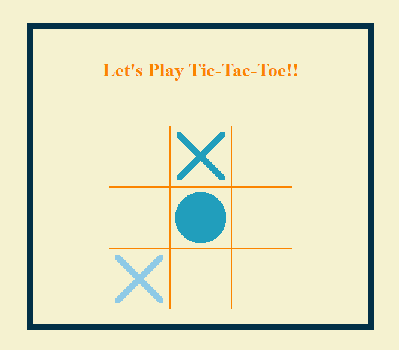
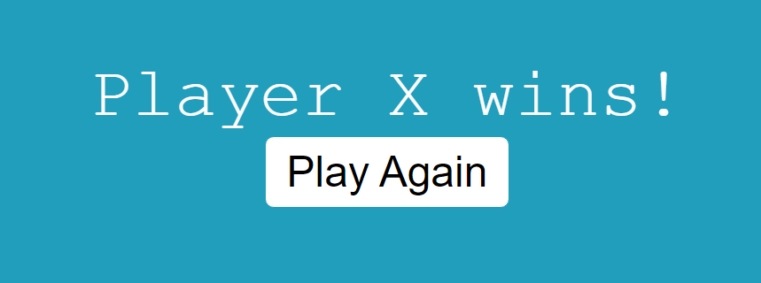

# tic-tac-toe

This is a simple tic-tac-toe game. When you hover over an empty cell, it will indicate whose turn it is by a blurred X or O that will darken when you make your move with a mouse click.

## Screenshots:

This is a view of a gameboard in play:   

  

This is a view of the message that displays when someone has won:   

  

## Reference:

Author: Amie Carroll

I would like to thank Nera Husarevic at https://www.codebrainer.com/blog/tic-tac-toe-javascript-game for template of this game.